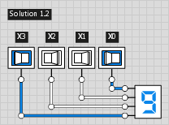

##### 2. One BCD digit: 4 bits in, 4 bits out #####
Trivial, the 4 BCD bits are identical to the binary representation:

##### 3. Up to 19: (0x13): 5 bits in, 5 bits out #####
Only input bit X4 gets ever shifted in as MSB.
So we really only need one stage, not 4 as in the original algorithm.

Compare this to the strict implementation of the original algorithm,
shifting in a 0 for each of the `n-1` repetitions.
.png)

##### 4. Up to 39: (0x27): 6 bits in, 6 bits out #####

##### 5. Up to 79 (0x4F): 7 bits in, 7 bits out #####

##### 6. Up to 99 (0x63): 8 bits in, 7 bits out #####

