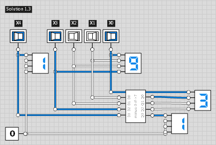
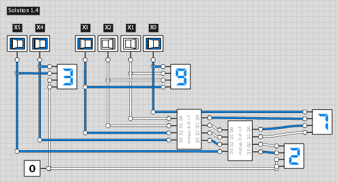
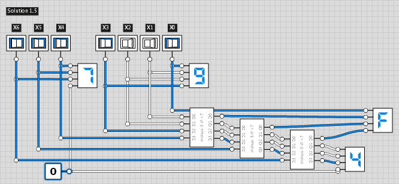

### 1.1. Solutions ###

##### 1a) One BCD digit: 4 bits in, 4 bits out #####
Trivial, the 4 BCD bits are identical to the binary representation:

##### 1b) Up to 19: 5 bits in, 5 bits out #####
Only input bit X4 gets ever shifted in as MSB.
So we really only need one stage, not 4 as in the original algorithm.

Compare this to the strict implementation of the original algorithm,
shifting in a 0 for each of the `n-1` repetitions.
.png)

The rightmost 3 stages can be omitted because our building block just passes through the inputs unchanged
if the topmost bit D3 is 0.

##### 1c) Up to 39: 6 bits in, 6 bits out #####
A small(er) solution for 6-bit conversion can be derived in the same way:
.png)

simplifies to

##### 1d) Up to 79: 7 bits in, 7 bits out #####

##### 1e) Up to 99: 8 bits in, 7 bits out #####

##### 1f) (\*): Beyond 99 #####
TODO

##### 2 (\*) How many binary digits from `n` decimal digits? #####
A number with `n` decimal digits takes `ceil(n/(log 2)` bits to represent in binary. `1/(log 2) ~ 3.322`, so `n*3` and `n*4` are rough lower and upper bounds.
 
TODO: say something about logarithms

##### 3 (\*) NAND Karnaugh groups #####
This has lots of Karnough maps, so has been placed in a separate file:
[`1_1_Solution_1`](1_1_Solution_1.md).

