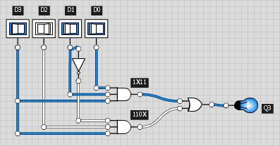
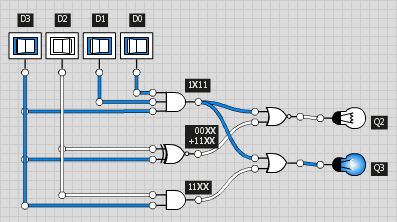
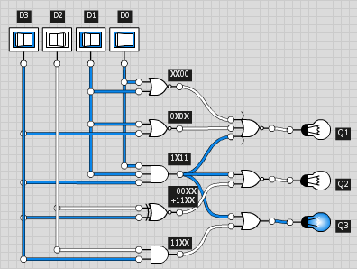

## BCD-to-Binary Conversion ##

### Algorithm ###
The algorithm works from LSB to MSB of the BCD representation, and produces the binary digits from LSB to MSB, too.
For `n` bits of BCD:

Start with a binary running result of 1 bit: the LSB of the BCD repr.
Then repeat `n-1` times:
1. right-shift the whole BCD repr. by one bit (throwing away the LSB)
2. subtract 3 from every (4-bit) BCD digit if it's (now) >7
3. add LSB of BCD repr. as MSB to your binary running result


**Why subtract 3?**
Well, the basic idea is of course to successively divide by 2 while keeping track of remainders mod 2.
However, since we have our number represented as 4-bit portions of BCD we cannot simply right-shift the whole thing in order to correctly divide it by 2.
We have to compensate for the fact that the bit that's shifted in to each BCD digit is worth 10/2=5, not 8.
Now, shifting in a 0 from the left is fine, since 0\*5 = 0\*8 = 0.
But shifting in a 1 actually means halving the current BCD digit (which is fine) and adding 8 - not quite, should be 5!
That's why you have to subtract 3 if a 1 happens to be shifted in.


### Circuit ###

Now let's implement this algorithm as a circuit in logicly.
Of course we do not (yet) want to commit to a particular number `n` of BCD bits, ie. roughly `n/4` decimal digits.
So we will aim for a suitably sized building block, from which we can then build a complete converter as large as we want.

An input size of 4 bits seems obvious, so let's just do this.
The shifting part is easy, we just have to wire up inputs to outputs appropriately.
This will cover steps 1 and 2 from above, so the inputs to our building block will be *the already right-shifted*
bits of BCD.
As for the conditional subtraction of 3, we consider each input pattern and its intended output.
There are at most 16=2^4 possible inputs, so let's just list them all:

#### Truth table 1 ###
```
D (dec) | D[3:0] | Q (dec) | Q[3:0]
--------|--------|---------|-------
     0  |  0000  |      0  |  0000
     1  |  0001  |      1  |  0001
     2  |  0010  |      2  |  0010
     3  |  0011  |      3  |  0011
     4  |  0100  |      4  |  0100
     5  |  0101  |      5  |  0101
     6  |  0110  |      6  |  0110
     7  |  0111  |      7  |  0111
     8  |  1000  |      5  |  0101
     9  |  1001  |      6  |  0110
    10  |  1010  |      7  |  0111
    11  |  1011  |      8  |  1000
    12  |  1100  |      9  |  1001
    13  |  1101  |     10  |  1010
    14  |  1110  |     11  |  1011
    15  |  1111  |     12  |  1100
```
Input values D=0..7 (decimal) are passed through as is, while D=8..15 get mapped to D-3, ie 5..12.

But hey, there can't be 16 valid input patterns if we assume a valid BCD input, which has only 10 different patterns per BCD digit.
**Which can actually occur and which cannot?**
Remember, the input bits are coming from *the already right-shifted* BCD representation.
The BCD values range from 0..9 in decimal, or 0000..1001 in binary.
Shifting in a 0 from the left gives 0..4, or 0000..0100.
Shifting in a 1 from the left gives 8..12, or 1000..1100.
So the outputs for input values 5, 6, 7, and 13, 14, 15 actually don't matter.

The following table shows the so-called **Don't-Care**s as dashes "-".

#### Truth table 2 ###
```
D (dec) | D[3:0] | Q (dec) | Q[3:0]
--------|--------|---------|-------
     0  |  0000  |      0  |  0000
     1  |  0001  |      1  |  0001
     2  |  0010  |      2  |  0010
     3  |  0011  |      3  |  0011
     4  |  0100  |      4  |  0100
     5  |  0101  |      -  |  ----
     6  |  0110  |      -  |  ----
     7  |  0111  |      -  |  ----
     8  |  1000  |      5  |  0101
     9  |  1001  |      6  |  0110
    10  |  1010  |      7  |  0111
    11  |  1011  |      8  |  1000
    12  |  1100  |      9  |  1001
    13  |  1101  |      -  |  ----
    14  |  1110  |      -  |  ----
    15  |  1111  |      -  |  ----
```

#### A better kind of truth table ####

Now, if we were to stare at the above table just long enough we might eventually "see" a good way of combining the input bits with AND, OR and the like s.t. they produce the output bits we want.

However, there is a better way. Let's rewrite the table in this form:
```
Q (decimal)                          Q[3:0] (binary)
      \ D[1:0]                             \ D[1:0]
D[3:2] \  00   01   11   10          D[3:2] \  00   01   11   10 
        +----+----+----+----+                +----+----+----+----+
     00 |  0 |  1 |  3 |  2 |             00 |0000|0001|0011|0010|
        +----+----+----+----+                +----+----+----+----+
     01 |  4 | -- | -- | -- |             01 |0100|----|----|----|
        +----+----+----+----+                +----+----+----+----+
     11 |  9 | -- | -- | -- |             11 |1001|----|----|----|
        +----+----+----+----+                +----+----+----+----+
     10 |  5 |  6 |  8 |  7 |             10 |0101|0110|1000|0111|
        +----+----+----+----+                +----+----+----+----+
```
Rows are labelled with the upper two input bits D3 and D2, columns with the lower two D1 and D0.
This again gives 16 entries, 6 of which we don't care about.

But **why are they so strangely ordered?** The point here is to have exactly one label bit changed between any two neighbouring rows or columns, respectively. Note that this is also true for the top and bottom row, and for the left and right column.
So we can consider these as "neighbours" in that sense as well.

Why this is helpful, we'll see in a minute. First let's split it up for each Q bit individually,
s.t. patterns and commonalities stick out even better:
```
    Q0                                 Q1
      \ D[1:0]                           \ D[1:0]
D[3:2] \  00   01   11   10        D[3:2] \  00   01   11   10 
        +----+----+----+----+              +----+----+----+----+
     00 |  0 |  1 |  1 |  0 |           00 |  0 |  0 |  1 |  1 |
        +----+----+----+----+              +----+----+----+----+
     01 |  0 |  - |  - |  - |           01 |  0 |  - |  - |  - |
        +----+----+----+----+              +----+----+----+----+
     11 |  1 |  - |  - |  - |           11 |  0 |  - |  - |  - |
        +----+----+----+----+              +----+----+----+----+
     10 |  1 |  0 |  0 |  1 |           10 |  0 |  1 |  0 |  1 |
        +----+----+----+----+              +----+----+----+----+

    Q2                                 Q3
      \ D[1:0]                           \ D[1:0]
D[3:2] \  00   01   11   10        D[3:2] \  00   01   11   10 
        +----+----+----+----+              +----+----+----+----+
     00 |  0 |  0 |  0 |  0 |           00 |  0 |  0 |  0 |  0 |
        +----+----+----+----+              +----+----+----+----+
     01 |  1 |  - |  - |  - |           01 |  0 |  - |  - |  - |
        +----+----+----+----+              +----+----+----+----+
     11 |  0 |  - |  - |  - |           11 |  1 |  - |  - |  - |
        +----+----+----+----+              +----+----+----+----+
     10 |  1 |  1 |  0 |  1 |           10 |  0 |  0 |  1 |  0 |
        +----+----+----+----+              +----+----+----+----+
```
These are the [Karnough maps](https://en.wikipedia.org/wiki/Karnaugh_map)
for our little BCD-to-binary building block.


#### Translating a Karnough map to logic ####

Let's get out logicly and turn the Karnough maps into gates.

##### AND, OR and NOT: Q3 #####

Take Q3: it's got two 1s. We'll address the entries by first stating D3 and D2, then D1 and D0; like so:
`11 00`, `10 11`.
This just means that Q3 should be 1 if
 - D3=1 AND D2=1 AND D1=0 AND D0=0
 - OR (D3=1 AND D2=0 AND D1=1 AND D0=1)
 
 or, like arithmetic where AND is implicit (like multiplication), OR is "+" (like addition)
 and NOT is "/" (like unary minus, or negation):
```
  Q3 = D3 D2 /D1 /D0 + D3 /D2 D1 D0
```


This is of course not optimal (in terms of the number of gates/gate input lines).
Note for example that the two columns on the left, 00 and 01 can be considered as identical,
because the Don't-cares - well, we don't care about.

The label bit that differs is D0, it appears as /D0 in the corresponding term.
But it actually makes no difference whether it is 0 or 1, so we can just leave it out:
```
  Q3 = D3 D2 /D1 + D3 /D2 D1 D0
```
`D3 D2 /D1` corresponds to an entry address `110X` with an X in the place of D0 where it doesn't matter.
Such an address with one X in it points to *a group of two neighbouring* entries, in this case
`1100` and `1101`.
This works just the same vertically, for example `1X11` for `1011` together with `1111`
(here it's D2 which doesn't matter). So this simplifies the expression for Q3 to
```
  Q3 = D3 D2 /D1 + D3 D1 D0
```


Not only are the AND gates smaller now, we don't need to invert D2 and D0 anymore.
But that's only the beginning.
Consider the address `11XX`: it points to the entire row 11 which we might as well set to all 1s.
This eliminates the remaining NOT:
```
  Q3 = D3 D2 + D3 D1 D0
```


In conclusion, we have made two groups of entries:
```
   11XX                               1X11
      \ D[1:0]                           \ D[1:0]
D[3:2] \  00   01   11   10        D[3:2] \  00   01   11   10 
        +----+----+----+----+              +----+----+----+----+
     00 |    |    |    |    |           00 |    |    |    |    |
        +----+----+----+----+              +----+----+----+----+
     01 |    |    |    |    |           01 |    |    |    |    |
        +----+----+----+----+              +----+----+----+----+
     11 | ##   ##   ##   ## |           11 |    |    | ## |    |
        +----+----+----+----+              +----+----+    +----+
     10 |    |    |    |    |           10 |    |    | ## |    |
        +----+----+----+----+              +----+----+----+----+
              D3 & D2                           D3 & D1 & D0
```

##### Adding NOR and XNOR to the game: Q2 #####
Now let's go for Q2, here's the Karnough map again:
```
    Q2
      \ D[1:0]
D[3:2] \  00   01   11   10
        +----+----+----+----+
     00 |  0 |  0 |  0 |  0 |
        +----+----+----+----+
     01 |  1 |  - |  - |  - |
        +----+----+----+----+
     11 |  0 |  - |  - |  - |
        +----+----+----+----+
     10 |  1 |  1 |  0 |  1 |
        +----+----+----+----+
```
You should already see that the above two groups also appear here, only that it's now 0s instead of 1s.
But it's easy to invert the end result: simply use a NOR instead of an OR to combine the group expressions.
The remaining group we need for Q2 is the first row, aka `00XX`.
We could use `/D3 /D2` for this, but `D3 NOR D2` is just the same, by deMorgan: `/D3 /D2 = /(D3 + D2)`.
It has the advantage that we still do not need to invert any of the input bits, thus keeping the gate
delay down at 2, rather than 3.

But wait, look at this:
```
  ????
      \ D[1:0]
D[3:2] \  00   01   11   10
        +----+----+----+----+
     00 | ##   ##   ##   ## |
        +----+----+----+----+
     01 |    |    |    |    |
        +----+----+----+----+
     11 | ##   ##   ##   ## |
        +----+----+----+----+
     10 |    |    |    |    |
        +----+----+----+----+
```
These are non-neighbouring rows, but they do have one thing in common.
Their respective label bits are equal in each case, 00 and 11.
There's a gate for this: XNOR.
So for Q2 we use the groups
```
00XX + 11XX                          1X11
      \ D[1:0]                           \ D[1:0]
D[3:2] \  00   01   11   10        D[3:2] \  00   01   11   10 
        +----+----+----+----+              +----+----+----+----+
     00 | ##   ##   ##   ## |           00 |    |    |    |    |
        +----+----+----+----+              +----+----+----+----+
     01 |    |    |    |    |           01 |    |    |    |    |
        +----+----+----+----+              +----+----+----+----+
     11 | ##   ##   ##   ## |           11 |    |    | ## |    |
        +----+----+----+----+              +----+----+    +----+
     10 |    |    |    |    |           10 |    |    | ## |    |
        +----+----+----+----+              +----+----+----+----+
             D3 XNOR D2                         D3 & D1 & D0
```
...and combine them with NOR:
```
  Q2 = (D3 XNOR D2) NOR (D3 D1 D0)
```



##### Nothing really new: Q1 #####
For Q1,
```
    Q1
      \ D[1:0]
D[3:2] \  00   01   11   10
        +----+----+----+----+
     00 |  0 |  0 |  1 |  1 |
        +----+----+----+----+
     01 |  0 |  - |  - |  - |
        +----+----+----+----+
     11 |  0 |  - |  - |  - |
        +----+----+----+----+
     10 |  0 |  1 |  0 |  1 |
        +----+----+----+----+
```
...we group 0s together like so:
```
  XX00                               0X0X                               1X11
      \ D[1:0]                           \ D[1:0]                           \ D[1:0]
D[3:2] \  00   01   11   10        D[3:2] \  00   01   11   10        D[3:2] \  00   01   11   10
        +----+----+----+----+              +----+----+----+----+              +----+----+----+----+
     00 | ## |    |    |    |           00 | ##   ## |    |    |           00 |    |    |    |    |
        +    +----+----+----+              +         +----+----+              +----+----+----+----+
     01 | ## |    |    |    |           01 | ##   ## |    |    |           01 |    |    |    |    |
        +    +----+----+----+              +----+----+----+----+              +----+----+----+----+
     11 | ## |    |    |    |           11 |    |    |    |    |           11 |    |    | ## |    |
        +    +----+----+----+              +----+----+----+----+              +----+----+    +----+
     10 | ## |    |    |    |           10 |    |    |    |    |           10 |    |    | ## |    |
        +----+----+----+----+              +----+----+----+----+              +----+----+----+----+
             D1 NOR D0                           D3 NOR D1                         D3 & D1 & D0
```
...and combine them with NOR:
```
  Q1 = NOR( (D3 NOR D1), (D1 NOR D0), (D3 D1 D0) )
```



##### XOR is a nice gate, too: Q0 #####
Finally, the Karnough map for Q0 contains some interesting patterns.
First, we can make it left-right symmetric by filling in suitable values for the Don't-cares at `0110` and `1110`.
```
    Q0                                 Q0
      \ D[1:0]                           \ D[1:0]
D[3:2] \  00   01   11   10        D[3:2] \  00   01   11   10 
        +----+----+----+----+              +----+----++---+----+
     00 |  0 |  1 |  1 |  0 |           00 |  0 |  1 || 1 |  0 |
        +----+----+----+----+              +----+----++---+----+
     01 |  0 |  - |  - |  - |           01 |  0 |  - || - |  0 |
        +----+----+----+----+   ~>         +----+----++---+----+
     11 |  1 |  - |  - |  - |           11 |  1 |  - || - |  1 |
        +----+----+----+----+              +----+----++---+----+
     10 |  1 |  0 |  0 |  1 |           10 |  1 |  0 || 0 |  1 |
        +----+----++---+----+              +----+----++---+----+
```
Now that's two pairs of identical columns: 01 and 11 on the one hand, plus 10 and 00 on the other
(remember: column 00 and 10 differ only in D1, so they're neighbours just like 01 and 11 are).
We can omit this kind of repetition, and make a Karnough map of just 3 variables, not 4 (leaving out D1):
```
    Q0                       Q0
      \ D0                     \ D0
D[3:2] \   0    1        D[3:2] \   0    1
        +----+----+              +----+----+
     00 |  0 |  1 |           00 |  0 |  1 |
        +----+----+              +----+----+
     01 |  0 |  - |           01 |  0 |  1 |
        +----+----+   ~>         +----+----+
     11 |  1 |  - |           11 |  1 |  0 |
        +----+----+              +----+----+
     10 |  1 |  0 |           10 |  1 |  0 |
        +----+----+              +----+----+
```
On the right-hand side I've already filled in the remaining Don't cares such that we get pairs of identical *rows* (00/01 and 11/10),
which leaves us with a Karnough map of only 2 variables, namely D3 and D0:
```
    Q0
      \ D0
    D3 \   0    1
        +----+----+
      0 |  0 |  1 |
        +----+----+
      1 |  1 |  0 |
        +----+----+
```
So there is a 1 exactly where D3 and D0 are unequal - that's XOR!
```
  Q0 = D3 XOR D0
```
That completes our basic building block. Here it is, together with two logicly "Digits" for easy testing:


---
Next up is how to combine these into a complete BCD-to-binary converter, together with a performance analysis.

### Tasks ###
In the meantime: try for yourself.
 1. The only gate we haven't used is NAND; what does it do to group expressions and what is its effect as combinator of group expressions? Can you find a way of putting it to good use here?
 2. Convert only 1 BCD digit to binary: 4 bits in, 4 bits out.
 3. Convert BCD inputs up to 19 (0x13): 5 bits in, 5 bits out.
 4. Convert BCD inputs up to 39 (0x27): 6 bits in, 6 bits out.
 5. Convert BCD inputs up to 79 (0x4F): 7 bits in, 7 bits out.
 6. Convert 2 BCD digits (up to 99 / 0x63): 8 bits in, 7 bits out.
Tasks 2 through 6 are of course meant to be solved with logicly, using the basic building block plus switches, light bulb, digits and labels.
