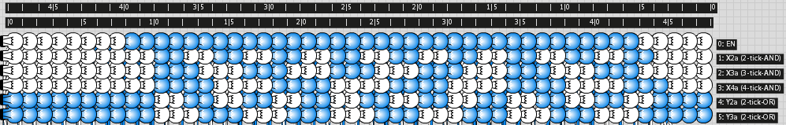

# 3 Oscillation #

## 3.1 Negative feedback: simple oscillator circuits ##

#### Using an AND-gate ####
Consider an AND-gate the output of which is **negated** and then **fed back** into one of the inputs:

If we switch on `EN`, the thing starts oscillating:

 ...and starts over.

So this has a **period** of 4 ticks, or a **half-period** of 2.

We can make the period longer by inserting a buffer:

 ...and repeats.

The period is 6, the half-period is 3.
Note that the number of gates in the loop equals the length of the half-period.

#### Works with OR as well ####

Just the same, except input and outputs are inverted.
So when `/EN` is switched off, it starts oscillating.
The pictures are shown below each other so we can see
more easily how the signal propagates through the loop

 1

 2

 3

 4

 5

 6

 7

 8

 1 (again)

...and so on.

## 3.2 Oscilloscope ##

### 3.2.1 The build ###
In the period-8 example above we start to see how patterns are shifted
through a series of buffers, from right to left.
The most recent signal (out of the NOT) is on the right (`Y3b`),
earlier ones are further to the left (`Y3c`, `Y3d`).

We can use this to build something that allows to inspect the development
of a signal over time in a much more comfortable way than with picture series as above.
Let's build an **oscilloscope**!

Start with a light bulb connected to a buffer:

Copy it and place **the new one to the left of the old**.
Connect the buffers and push them together st. the light bulbs overlap like this:

to make

Repeat with the thing you just build.
Make sure to **place the copy to the left** of the original,
since otherwise the light bulbs won't overlap correctly.

to make

It is crucial that get the overlap right.
Here's how it looks like if you did it wrong:

We repeat this until we have a suitably long chain.
The length determines how far "back in time" we will be able to see.
So we have to decide upon the "memory depth" of our oscilloscope.
32 is a bit short, 64 is too much. Let's make 48 = 16 + 32. That is:
Go up to 16, and keep a copy of this before doubling again.
Once you have the 32 you place that **to the left of the old 16**.
Finally it should look like this:

Now it's time to add a second channel to our oscilloscope,
allowing us to see two different signal in relation to each other.
For this we copy the chain of 48 and **place the copy above the original**.

Before we drag them onto each other we have to decide how we want the "channel inputs"
to be ordered.
Obviously it's better to have them in the same order as their respective "channel displays",
so the light bulbs on top should be connected to the upper chain of buffers.

To achieve this: in the orignal (the bottom one), pull down the line of buffers to make space for
the buffers of the copy (the top one) we just made.
Finally drag the copy down over the original like so:

to make

Now there are way too many connections crossing each other, and below components.
That is, too many for us to see anything useful in them during simulation.
That's not a problem - we've got the light bulbs compact and nicely ordered for this -
but then we can as well drag the buffer chains on top of each other in order to save
some space.

Drag down the upper chain, rather than the lower one up, as even more channels are to be
added.

6 channels are sufficient. As a last step, the buffers of the right-most column have been dragged out and rotated (individually), in order to make connecting to them easier.

Two rulers have also been added, one measuring from left to right (that would be the time in ticks), and the other from measuring from right to left (for convenience).

### 3.2.2 The test ###
Finally, it's time to test the oscilloscope.
Connect the simple oscillator circuits from the beginning.

Here's a complete trace with `EN` switched on from T=3 to T=44 (channel 0).
The oscillation starts at T=5 and ends at T=46.

## 3.x Adjustable frequency oscillator ##

### 3.x.y Frequency divider ###

#### Selecting the divisor ####
	half-period [ticks] (n)
	       \ base half-period
	        \   2       3       5       7       9      11      13      15      17
	 divisor +-------+-------+-------+-------+-------+-------+-------+-------+-------+
	    DIV1 |  2    |  3    |  5    |  7    |  9    | 11    | 13    | 15    | 17(1) |
	         +-------+-------+-------+-------+-------+-------+-------+-------+-------+
	    DIV2 |  4    |  6    | 10    | 14    |       |       |       |       |       |
	         +-------+-------+-------+-------+-------+-------+-------+-------+-------+
	    DIV4 |  8    | 12    |       |       |       |       |       |       |       |
	         +-------+-------+-------+-------+-------+-------+-------+-------+-------+
	    DIV8 | 16(0) |       |       |       |       |       |       |       |       |
	         +-------+-------+-------+-------+-------+-------+-------+-------+-------+

Karnaugh maps for DIV1, DIV2, DIV4 and DIV8:

	   DIV1                                 DIV2
	      \ S[1:0]                             \ S[1:0]
	S[3:2] \  00   01   11   10          S[3:2] \  00   01   11   10 
	        +----+----+----+----+                +----+----+----+----+
	     00 |  0 |  1 |  1 |  1 |             00 |    |    |    |    |
	        +----+----+----+----+                +----+----+----+----+
	     01 |  0 |  1 |  1 |  0 |             01 |  4 |    |    |  6 |
	        +----+----+----+----+                +----+----+----+----+
	     11 |  0 |  1 |  1 |  0 |             11 |    |    |    | 14 |
	        +----+----+----+----+                +----+----+----+----+
	     10 |  0 |  1 |  1 |  0 |             10 |    |    |    | 10 |
	        +----+----+----+----+                +----+----+----+----+
	        NOR(DIV2, DIV4, DIV8)               /S3 S2 /S0 + S3 S1 /S0

	   DIV4                                 DIV8
	      \ S[1:0]                             \ S[1:0]
	S[3:2] \  00   01   11   10          S[3:2] \  00   01   11   10 
	        +----+----+----+----+                +----+----+----+----+
	     00 |    |    |    |    |             00 |  1 |  0 |  0 |  0 |
	        +----+----+----+----+                +----+----+----+----+
	     01 |    |    |    |    |             01 |  0 |  0 |  0 |  0 |
	        +----+----+----+----+                +----+----+----+----+
	     11 | 12 |    |    |    |             11 |  0 |  0 |  0 |  0 |
	        +----+----+----+----+                +----+----+----+----+
	     10 |  8 |    |    |    |             10 |  0 |  0 |  0 |  0 |
	        +----+----+----+----+                +----+----+----+----+
                 S3 /S1 /S0                       NOR(S3, S2, S1, S0)

blah
